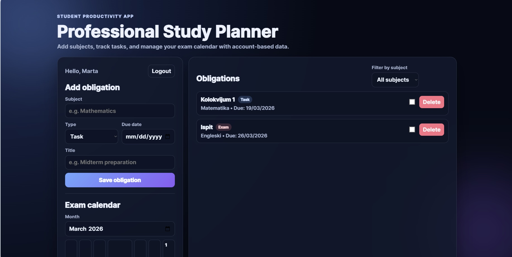

# Study Planner Pro

Full-stack web application for planning study tasks and exams.

## Screenshot


## Features
- User authentication
- Task CRUD
- Filtering tasks (status, date, subject, priority)
- Calendar view
- Responsive design
- REST API
- MySQL database ready architecture (current local DB: SQLite)

## Tech Stack
- Frontend: HTML, CSS, JavaScript (Vanilla)
- Backend: Node.js, Express
- Database: SQLite (sqlite3)
- Auth security: bcryptjs, express-session
- Validation: Zod
- API protection: express-rate-limit
- Testing: Node test runner + Supertest

## API Routes

### Auth
- POST /api/auth/register - Register a new user
- POST /api/auth/login - Log in user and create session
- POST /api/auth/logout - Log out user and destroy session
- GET /api/auth/me - Get currently authenticated user

### Tasks and Data
- GET /api/tasks - Get all user tasks (optional `?subject=...&status=...&dueDate=...&priority=...` filters)
- POST /api/tasks - Create a new task/exam item
- PATCH /api/tasks/:id - Update task status (`todo`, `in_progress`, `done`)
- DELETE /api/tasks/:id - Delete a task by ID
- GET /api/subjects - Get distinct subjects for the logged-in user
- GET /api/exams-calendar?month=YYYY-MM - Get monthly exam calendar entries

## Architecture
Frontend (HTML, CSS, JavaScript) communicates with an Express backend through a REST API.
The backend handles authentication, sessions, and database operations using SQLite.
Passwords are hashed with bcryptjs before being stored.

Request flow overview:
- Browser (public/index.html + public/script.js) sends JSON requests to API routes.
- Express app validates input, checks session/auth state, and calls controller/service layers.
- Services execute SQL queries through a shared DB module.
- API responds with consistent JSON success/error format.

Backend structure:
- server.js: app bootstrap + DB initialization + HTTP listener
- app.js: Express app composition (middleware + routes)
- routes/: route definitions and middleware chaining
- controllers/: request validation and response orchestration
- services/: data access and business logic
- validation/schemas.js: central Zod schemas
- middleware/requireAuth.js: reusable session auth guard
- middleware/rateLimiter.js: auth endpoint rate limiting
- middleware/errorHandler.js: async wrapper + centralized 500 error responses

## Why SQLite
- Lightweight and file-based, ideal for internship/demo deployment and quick onboarding.
- Zero external DB setup required, so the project runs locally with minimal friction.
- SQL schema + indexes are explicit and easy to discuss in interviews.
- Easy migration path later to PostgreSQL/MySQL if scale requirements grow.

## Security and Validation Notes
- Passwords are hashed using bcryptjs before storing.
- Session cookies use httpOnly and sameSite protections.
- Input payloads are validated with Zod schemas.
- Task validation enforces non-empty title, future/today due date, and description max length.
- Auth routes use rate limiting to reduce brute-force attempts.
- API uses centralized internal error responses to avoid leaking stack details.
- In production, SESSION_SECRET is required.

## Testing
- Automated API tests cover auth flow and task CRUD flow.
- Test stack: Node built-in test runner + Supertest.
- Tests run against an isolated SQLite test database.

Run tests:
```bash
npm test
```

## What I Would Improve Next
- Add account lockout / progressive delay strategy after repeated failed logins.
- Add CSRF protection layer for state-changing requests.
- Expand tests for edge cases and negative scenarios.
- Add CI pipeline and environment-specific config for production deployment.

## Run the Project
1. Clone the repository:
	```bash
	git clone https://github.com/KristinaDoslov/StudyPlanner.git
	cd StudyPlanner
	```

2. Install dependencies:
	```bash
	npm install
	```

3. Start the server:
	```bash
	npm start
	```

4. (Optional) Run tests:
	```bash
	npm test
	```

5. Open the app:
	- http://localhost:3000

## Environment Variables
- SESSION_SECRET: required in production
- PORT: optional (default: 3000)
- DATABASE_PATH: optional custom SQLite file path (used by tests)

## Project Structure
### Backend
- controllers/
- routes/
- services/
- models/
- middlewares/

### Frontend
- public/components/
- public/pages/
- public/services/
- public/hooks/
- public/index.html
- public/styles.css
- public/script.js

Other key files:
- app.js - Express app wiring (middleware + routes)
- server.js - startup bootstrap
- validation/schemas.js - request schemas
- tests/ - automated API tests
- database/database.db - SQLite database (created automatically on startup)

## Author
Kristina Došlov
